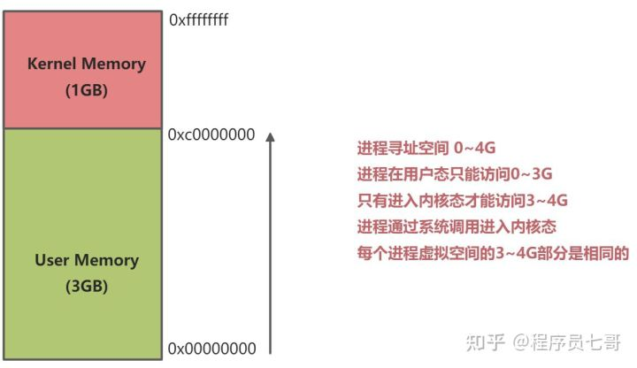
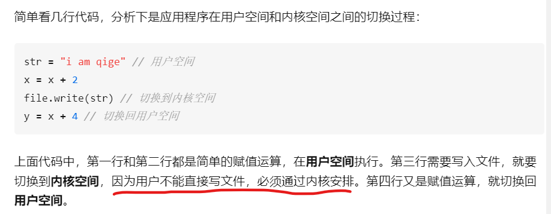
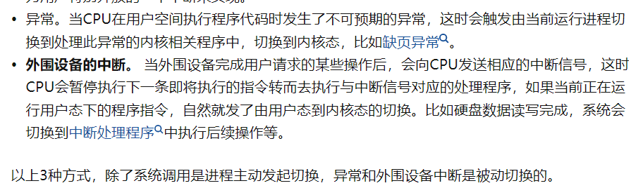
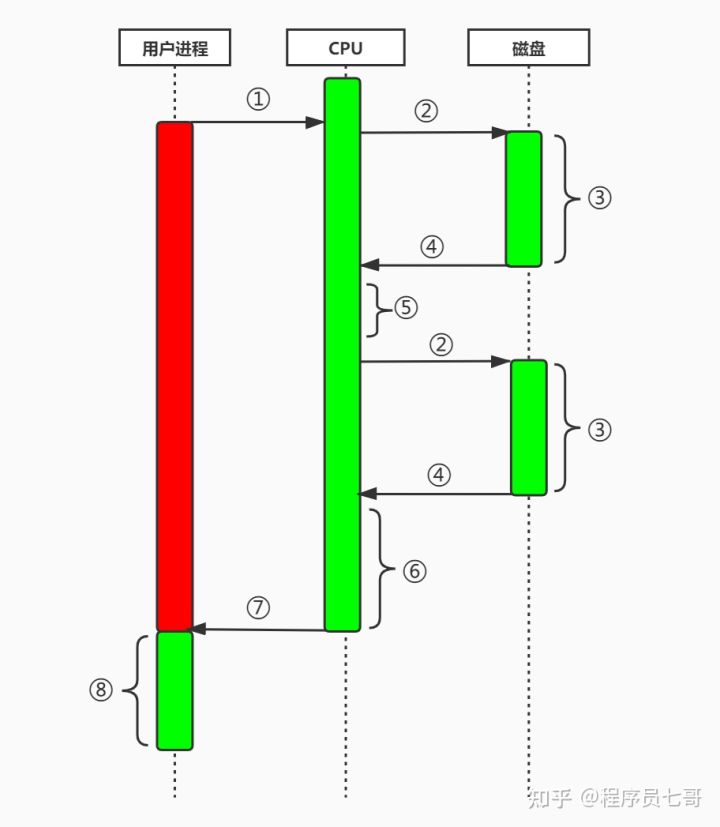
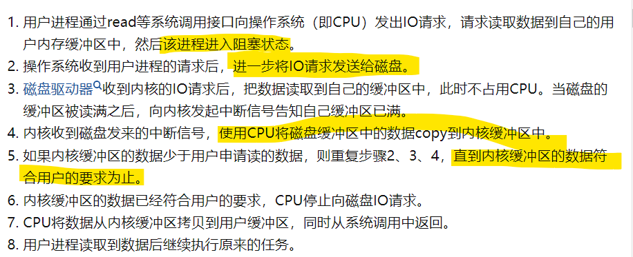
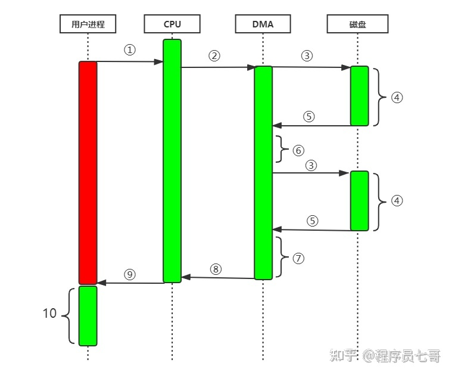
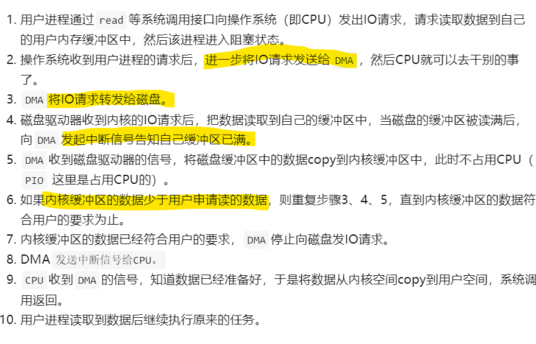
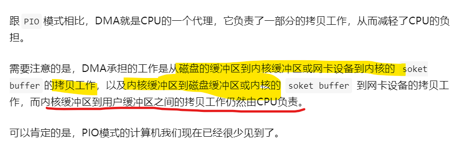
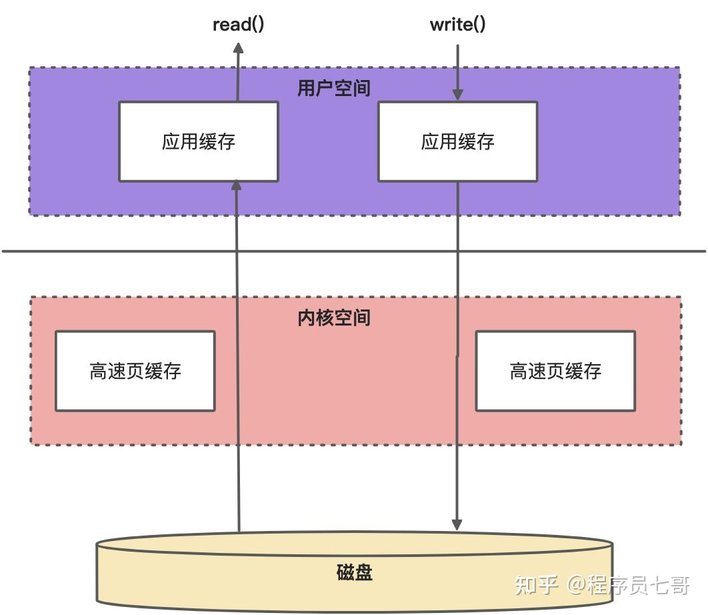

# JAVA IO

IO要学得好就要设计操作系统层面，而且一般高性能服务器
的原理也离不开IO。 

IO操作会涉及用户空间和内核空间的转换，先理解

1. 内存空间分为用户空间和内核空间，也称为用户缓存区和内核缓存区
2. **用户的应用程序不能直接操作内核空间** 需要将数据从内核空间拷贝到
用户空间才能使用
3. 无论是read操作,还是write操作，都只能在内核空间里面执行
4. 磁盘IO和网络IO请求加载到内存的数据都是先放在内核空间
里面的

## 用户空间 vs 内核空间
Virtual Memory被操作系统分为两部分

1. User Space 用户空间：用户程序代码运行的地方
2. Kernel Space 内核空间：内核代码运行的地方

内核空间可以执行任意的命令，而用户空间只能执行简单的运算，

### 用户态切换到内核态的3种方式

1. System Call（系统调用），是用户态进程主动要求切换到内核态的一种方式，
用户态进程使用操作系统提供的服务，比如说写文件应用（如上图），还有像fork()
函数也是执行了一个创建新进程的系统调用。而系统调用机制的核心还是使用了操作系统为用户特别
开放的一个中断来实现的
2. 异常
3. 外围设备的中断

### PIO工作原理: 每次IO请求都需要CPU多次参与，效率很低

## 缓冲IO和直接IO

缓冲IO：磁盘中的数据先通过DMA拷贝到内核空间，再到用户空间

优点：1. 一定程度上分离了内核空间和用户空间，保护系统本身的
安全。2. 因为内核中有缓冲，可以减少读盘的次数，提高性能。

缺点：数据拷贝所带来的CPU及内存开销大

引入内核缓冲区是为了提升磁盘读写数据文件的性能，多一层缓存可以有效减少很多磁盘I/O操作
而当用户程序需要向磁盘文件写入数据时，实际上只要写入
内核缓冲区就可以返回，真正的落盘有一定的延迟，但是提高了
应用程序写入文件的响应速度。

直接IO：瓷盘中的数据通过DMA直接到用户中心，而不经过
内存缓冲区，这样的目的是**减少一次从内核缓冲区到用户程序
缓冲的数据复制**

优点：最直观的目的是减少一次从内核缓冲区到用户程序缓冲
的数据复制，这种方式通常用在数据库，消息中间件，**由应用程序来
实现数据的缓存管理**

缺点：如果访问的数据不在应用程序缓冲中，就得直接从磁盘中加载
这种直接加载会非常缓慢。通常，直接I/O和异步IO结合的效果较好（
异步IO：当访问数据的线程发出请求后，线程会接着去处理事，而不是阻塞等待）

