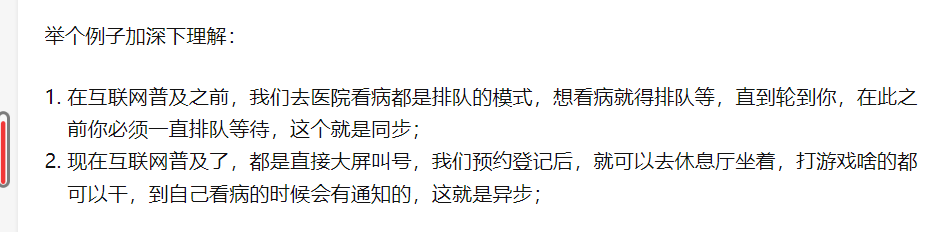
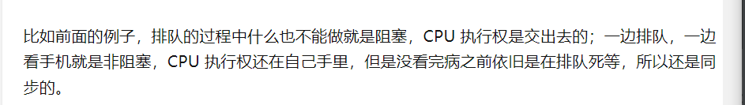

# NIO

同步和异步是针对应用程序向内核发起任务后的状态而言的：如果发起调用后，
在没有得到结果之前，没有调用就不返回，不能做后面的事情，一直等待就是同步。

异步就是发出调用后，虽然不能立即得到结果，但是可以继续执行后面的事情。等调用的结果出来时，会通过
状态、通知和回调来通知调用者。

Blocking阻塞、nonblocking这是聚焦CPU在等待结果的过程中的状态

阻塞调用是指的是调用结果返回之前，该线程会被挂起，自由得到结果才返回。
同步只是说等到出结果才可以返回，但是等的过程中
线程是可以激活的，阻塞是说县城北挂起

非阻塞是在不能得到结果之前，该函数不会阻塞当前线程，而会立即
返回。

https://mp.weixin.qq.com/s?__biz=MzkxODI2MDMzMA==&mid=2247485777&idx=1&sn=6fcb5af0a7028d7a88237558d4f5dac9&chksm=c1b55654f6c2df42c648b0d8e177c97f33e155ff13f910515fd026161767c012ed76e1627548&token=1601711&lang=zh_CN#rd

使用NIO != 高性能，当连接数<1000，并发程度不高或者局域网环境下NIO并没有显著的性能优势。

NIO并没有完全屏蔽平台差异，它仍然是基于各个操作系统的I/O系统实现的，差异仍然存在。使用NIO做网络编程构建事件驱动模型并不容易，陷阱重重。

推荐大家使用成熟的NIO框架，如Netty，MINA等。解决了很多NIO的陷阱，并屏蔽了操作系统的差异，有较好的性能和编程模型